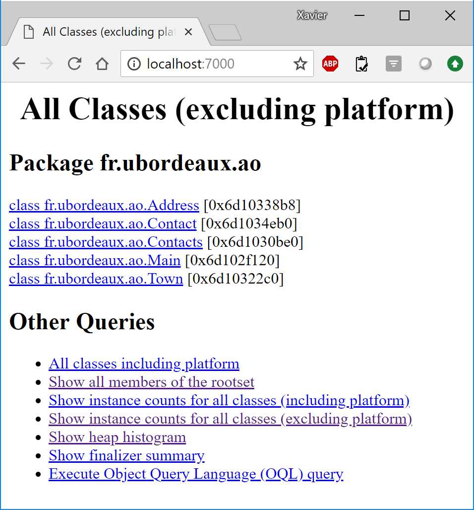

# TD1

Ce TD a pour objectif de :

* Vérifier votre connaissance sur les principes de l'objet
* Vérifier que vous savez compiler et exécuter du code Java (avec Javac et Gradle)
* Vous montrer qu'on peut compter le nombre d'objets présents dans une machine vituelle

## Connaissance sur les principes de l'objet

Expliquez la relation entre cohérence et couplage.

Une application composée d'un unique gros objet serait-elle fortement ou faiblemen cohérente / couplée ?

Une application composée d'un nombre important de petits objets serait-elle fortement ou faiblemen cohérente / couplée ?

## Javac & Java

En utilisant Javac, compilez le code situé dans le répertoire td1/src/main/java et faites en sorte que les classes compilées se retrouvent dans le répertoire td1/classes.

En utilisant Java, exécutez le code que vous venez de compiler.

En utilisant Gradle, compiler le code du TD1

En utilisant Gradle, exécuter le test du TD1

## Objets et Machine Virtuelle

Vous allez utiliser les outils **jps**, **jmap** et **jhat** pour analyser la machine virtuelle Java et compter le nombre d'objets Java créés.

### JPS

L'utilitaire **jps** permet d'identifier les programmes Java en cours d'exécution. Chaque programme est identifié par un numéro.
Exécutez le TD1 puis, dans une autre console de votre shell, exécutez jps pour connaître le numéro du programme.

Par exemple suivant, le Shell1 exécute le TD1.

    Shell1:> java -cp ./classes fr.ubordeaux.ao.Main
    3000 contacts created !

Puis le Shell2 exécute **jps**. On voit que l'exécution du TD1 est en cours. Elle s'appelle **Main** et est identifiée par le numéro **82148**.

    Shell2:> jps
    49572 org.eclipse.equinox.launcher_1.5.100.v20180611-1436.jar
    82148 Main
    33528 Jps

### JMAP

L'utilitaire **jmap** permet de construire un dump d'une exécution et de la sauver dans un fichier pour analyser l'état de la machine Virtuelle.

En continuant l'exemple, et toujours pendant que le TD1 s'exécute, l'exécution de **jmap** construit un dump de la machine virtuelle et le sauve dans le fichier **C:/tmp/x.dmp**

    Shell2:> jmap -dump:file=C:/tmp/x.dmp 82148

### JHAT

Enfin, l'utilitaire **jhat** propose des analyses du fichier dump et permet notamment de compter le nombre d'objets construits.

En continuant l'exemple, l'utilitaire **jhat** lance un serveur web sur le port 7000 qui présente les analyses de la machine virtuelle.

    Shell2:> jhat C:/tmp/x.dmp
    Reading from C:\tmp\x.dmp...
    Dump file created Thu Jul 26 20:24:03 CEST 2018
    Snapshot read, resolving...
    Resolving 42227 objects...
    Chasing references, expect 8 dots........
    Eliminating duplicate references........
    Snapshot resolved.
    Started HTTP server on port 7000
    Server is ready.

Avec un navigateur web (Chrome), il est possible d'ouvrir la page **http://localhost:7000** et ainsi voir le résultat de l'analyse.

### A vous de jouer

* Utilisez **jps**, **jmap** et **jhat** pour compter combien d'objets sont créés lors de l'exécution du TD1.
* Modifier le code pour qu'il n'y ait qu'un seul objet pour la ville Talence (et non pas 3000).
* Dans le code, modifiez la valeur de **MAX** pour connaître le nombre maximal d'objets qu'il est possible de loger en mémoire avant de faire crasher la VM

